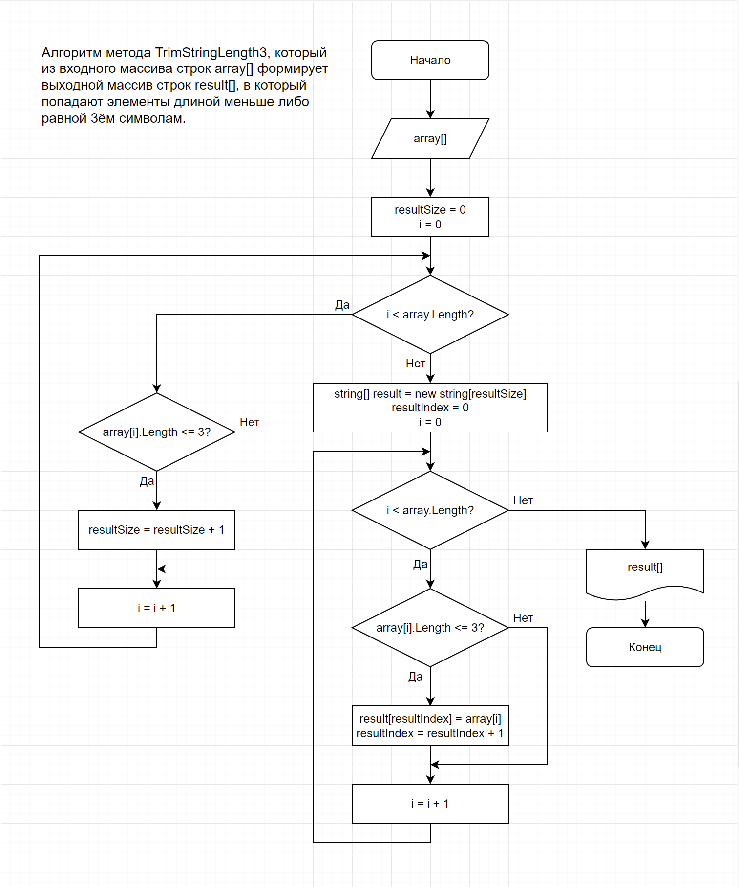

# Итоговая проверочная работа по курсу "*Выбор специализации*"
## Описание задачи

**Задача**: Написать программу, которая из имеющегося массива строк формирует массив из строк, длина которых меньше либо равна 3 символа. Первоначальный массив можно ввести с клавиатуры, либо задать на старте выполнения алгоритма. При решении не рекомендуется пользоваться коллекциями, лучше обойтись исключительно массивами.

**Примеры**:

["hello", "2", "world", ":-)"] -> ["2", ":-)"]

["1234", "1567", "-2", "computer science"] -> ["-2"]

["Russia", "Denmark", "Kazan"] -> []

## Описание решения задачи

Для решения поставленной задачи на языке С# создан метод **TrimStringLength3**, принимающий на вход исходный массив строк и формирующий на выходе массив строк с элементами, длина которых меньше либо равна 3-ём символам.

Для того, чтобы узнать длину выходного массива, создана переменная **resultSize**, которой изначально присвоено значение 0. Для её определения используется цикл по всем элементам входного массива. На каждом этапе цикла проверяем миньше ли либо равен 3-ке текущий элемент входного массива, если да, то увеличиваем переменную **resultSize** на 1-цу, в противном случае оставляем без изменений.

Далее создаём выходной массив **result[]** длина которого равна **resultSize**. Для индексации элементов выходного массива вводим новую переменную **resultIndex**, которой изначально присваиваем 0. Для заполнения выходного массива используем цикл по всей длине входного массива. На каждом этапе цикла проверяем миньше ли либо равен 3-ке текущий элемент входного массива, если да, то кладём текущий элемент входного массива в выходной массив и увеличиваем индекс выходного массива **resultIndex** на 1-цу, в противном случае переходим на следующий круг цикла.

Также в поставленной задаче используются следующие методы:
 * **GetStringArrayFromConsole**
 * **PrintStringArray**

 Метод **GetStringArrayFromConsole** используется для организации ввода элементов строкового массива из консоли, т.е. он не имее входных параметров, а на выход выдаёт массив строк.

 Метод **PrintStringArray** используется для вывода элементов массива строк в консоль, т.е. на вход передаётся массив строк, а выходных параметров данный метод не имеет.

## Блок-схема алгоритма метода **TrimStringLength3**

